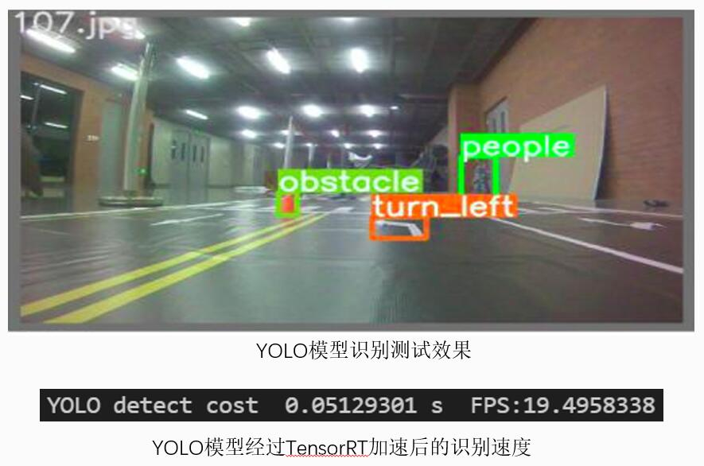

# cfzs_selfDriving
&emsp;&emsp;无人驾驶挑战赛国一作品，基于Jatson Nano B01平台开发，在现实场景的打印赛道测试，主要算法涉及Unet、YOLO、PID、机器人行为状态机、传统视觉方法，处理帧率高达15FPS。

## 任务分析
&emsp;&emsp;本次[无人驾驶挑战赛](http://ai.jsjds.cn/2021/Default_C.aspx?id1=1&id2=2)，旨在设计无人驾驶机器人基于真实环境进行6：1缩放的模拟道路上实现无人驾驶技术：能够实现主要交通标志的识别，根据相应标志做相应的动作，并在规定时间内完成比赛。交通标志包括红绿灯、车道线、地面车道指示标识（方向标识，人行道）、隧道。在遇到障碍物时，车辆能够在不违反交通规则的情况下变换车道规避障碍物。根据比赛要求和规则限制，我们将问题拆分成三大部分，进行详细描述和分析。

## 方案设计

通过分析，我们将规则分为三大任务，并设计技术方案：
- 对于车道线检测，设计了两种方案，即TensorRT加速的UNet深度学习模型与传统计算机视觉方案，并对比了不同方案的计算速度和性能；
- 对于识别标识，使用TensorRT加速的YOLO模型检测环境内不同的物体，在此基础上，使用分割与灰度计算的方案识别交通信号灯；
- 对于行驶控制，在实现上述功能的基础下，设计沿车道线行驶的PID算法模型，并设计控制无人行驶的机器人行为状态机，以应对复杂交通情况。

## 实验效果

&emsp;&emsp;通过上述实验进行分析，在识别效果方面，Unet模型可以很好地检测出远处的车道线，并且排除近处斑马线人行道的干扰，而传统计算机视觉却误将近处斑马线识别为车道线，导致识别偏差。在识别速度方面，Unet模型识别的FPS达到了**26FPS**，远远超过传统计算机视觉方案的**10FPS**。**结论是无论在速度上，还是在效果上，Unet深度学习模型都远远胜过传统计算机视觉方案。**

&emsp;&emsp;识别效果方面，UNet、LaneNet、SegNet三者的识别效果都差不多；
速度方面，UNet模型作为一个轻量级深度学习模型，其速度是最能满足速度需求的；
因此我们选取了UNet模型来进行车道线检测。

&emsp;&emsp;YOLO模型一如既往的强大，在使用过程中没有遇到任何问题，识别效果和速度都非常好。

## 遇到的问题
- [x] Jatson Nano B1只支持SCI摄像头，通过python调用时，需要相应的代码。
- [x] sci 摄像头抽取图片会有2s的延迟
- [x] Jatson Nano只有一块GPU，需要Unet与YOLO模型同时在同一块GPU上运行（多线程通信）
- [ ] GPU占用率高达98%，Nano易死机。
- [ ] 红绿灯识别功能易受光线影响

## 联系我们
- 队长  yh   yehao1999.6@gmail.com
- 队员  zdl  zhangdelong42@gmail.com
- 队员  zxz  zhaoxingzhe0125@gmail.com

## 致谢
NEU 机器人学院智能车实验室的老师和各位大佬童鞋
